# Project Organization Guide - Empire at War

- Scope: **Empire at War** Unity asset organization and naming rules.
- Layout: Type-first.
- Root folder → asset type; subfolder → domain/category.

## Structure Overview

```mermaid
graph TD
    A["Assets/"] --> Art["Art/ - Visual assets"]
    A --> Audio["Audio/ - Sound effects and music"]
    A --> Plugins["Plugins/ - Core external plugins (Zenject, Demigiant)"]
    A --> Prefabs["Prefabs/ - Reusable GameObject prefabs"]
    A --> Scripts["Scripts/ - C# source code"]
    A --> Settings["Settings/ - Configuration assets, URP & Lighting"]
    A --> Scenes["Scenes/ - Game levels"]
    A --> Sandbox["Sandbox/ - Development and prototypes (on demand)"]
    A --> ThirdParty["ThirdParty/ - External vendor assets (TextMesh Pro)"]
    A --> Addressables["AddressableAssetsData/ - Addressables config (do not alter)"]
    A --> Resources["Resources/ - Minimal bootstrap only"]

    Art --> Art1["Models/ - 3D meshes & companion files"]
    Art --> Art2["Materials/ - Material definitions"]
    Art --> Art3["Textures/ - Textures, sprites, UI images"]
    Art --> Art4["Animation/ - Controllers and animation clips"]
    Art --> Art5["Shaders/ - Custom shaders and materials"]

    Audio --> Aud1["Music/ - Background music tracks"]
    Audio --> Aud2["SFX/ - Sound effects"]

    Prefabs --> P1["Models/ - Entity prefabs (Ships, Stations, Platforms)"]
    Prefabs --> P2["Ui/ - Canvases, HUDs, menus, and widgets"]
    Prefabs --> P3["View/ - Zenject context and orchestration"]
    Prefabs --> P4["Vfx/ - Visual effect prefabs"]
    Prefabs --> P5["Light/ - Light setup prefabs"]

    Scripts --> S1["Components/ - Logic and presentation components"]
    Scripts --> S2["Entities/ - Pure C# state models and business rules"]
    Scripts --> S3["Services/ - Global systems and Zenject installers"]
    Scripts --> S4["Editor/ - Editor tooling and maintenance scripts"]
    Scripts --> S5["Tests/ - Automated unit and integration tests"]

    Settings --> Set1["Render Pipelines/ - URP pipeline and renderer assets"]
    Settings --> Set2["Lighting/ - Scene lighting settings (.lighting)"]
    Settings --> Set3["Input/ - Input System actions and settings"]
    Settings --> Set4["Data/ - Game databases and ScriptableObjects"]
```

## Root Folder Definitions

### 1. Art (`Assets/Art`)

- **Models/**: 3D meshes (`.fbx`, `.obj`, `.dae`, `.blend`), MTL companion files, and mesh assets.
  - Path: `Assets/Art/Models/<Category>/<Asset>/<Asset>.<ext>`
- **Materials/**: External material definitions (`.mat`).
  - Model materials: `Assets/Art/Materials/Models/<Category>/<Asset>/<Asset>_<PartOrSlot>[_Variant].mat`
  - Wreck materials: `Assets/Art/Materials/Wrecks/<UnitFolder>/<SourceMaterial>_Wreck.mat`
  - Shared VFX materials: `Assets/Art/Materials/Vfx/`
  - Retained unclassified: `Assets/Art/Materials/Unclassified/`
- **Textures/**: Image files (`.png`, `.jpg`, `.jpeg`, `.tga`).
  - Model textures: `Assets/Art/Textures/Models/<Category>/<Asset>/<Asset>_<PartOrSet>_<MapOrSource>[_Variant].<ext>`
  - Shared VFX textures: `Assets/Art/Textures/Vfx/`
  - UI textures & icons: `Assets/Art/Textures/Ui/`
  - Retained unclassified: `Assets/Art/Textures/Unclassified/`
- **Animation/**: Animator Controllers (`.controller`), Animation Clips (`.anim`), and Avatar Masks.
- **Shaders/**: Shaders (`.shader`, `.hlsl`) and shader-specific textures.

### 2. Audio (`Assets/Audio`)

- **Music/**: Background music tracks.
- **SFX/**: Sound effect audio clips.

### 3. Prefabs (`Assets/Prefabs`)

- **Models/**: Entity prefabs representing physical game objects (Ships, Defense Platforms, Stations).
- **Ui/**: Canvases, menus, HUD elements, and modal dialogs.
- **View/**: Non-physical orchestration prefabs (e.g. `ZenjectContext/SceneContext.prefab`).
- **Vfx/**: Reusable visual effect prefabs.
- **Light/**: Reusable lighting configuration prefabs.

### 4. Scripts (`Assets/Scripts`)

- **Components/**: MonoBehaviours driving view rendering and user input (MVP View).
- **Entities/**: Pure C# domain models, states, and business rules (MVP Model).
- **Services/**: Application and game services, presenters, and Zenject installers (MVP Presenter).
- **Editor/**: Editor tools, builders, windows, and custom inspectors.
- **Tests/**: EditMode and PlayMode automated test suites.

### 5. Settings (`Assets/Settings`)

- **Render Pipelines/**: URP pipeline assets (`UniversalRenderPipelineAsset`), renderer data (`UniversalRendererData`), and sample volume profiles (`.asset`).
- **Lighting/**: Scene lighting configuration assets (`.lighting`).
- **Input/**: `.inputactions` and `.inputsettings` assets.
- **Data/**: Game databases and shared configuration ScriptableObjects.

### 6. Plugins (`Assets/Plugins`)

- Core third-party plugins integrated into the project architecture.
- **Zenject**: Dependency injection framework.
- **Demigiant**: DOTween animation engine.

### 7. ThirdParty (`Assets/ThirdParty`)

- External vendor packages and tools from Asset Store or external repos (e.g. `TextMesh Pro`).

### 8. Resources (`Assets/Resources`)

- Minimal bootstrap assets only.
- Allowed bootstrap exceptions: `ProjectContext.prefab`, `SceneContext.prefab`, `DOTweenSettings.asset`.

### 9. Sandbox (`Assets/Sandbox`)

- Development and testing sandbox; created strictly on demand.
- Do not create or commit empty prototype folders.

## Placement & Naming Rules

1. **Type-First**: Asset placement is determined by type at the root level (`Art/Models`, `Art/Materials`, `Art/Textures`).
2. **Model Categories**: Meshes, materials, and textures must use consistent categories:
   - `RepublicShips`: Republic vessels (AWing, Acclamator, Arquitens, Delta7, StarDestroyer1, StarDestroyer2, HeavyDreadnought, Thranta, Venator, AcclamatorAssault).
   - `SeparatistShips`: Separatist vessels (Belbullab22, Lucrehulk, Munificent, Providence, Recusant).
   - `SpaceStations`: Space stations (SpaceStationModular, Freeport, OpenSpaceStation, GangutStation, RefuelingStation, AsteroidMiningFacility, VestaStation, HaloStation).
   - `DefendPlatforms`: Defense installations (XQ6Platform).
   - `Asteroids`: Natural space hazards (Asteroid01).
   - `Planets`: Celestial bodies (Coruscant, Kamino, Moon).
   - `Cannons`: Turrets and heavy weapons (HeavyTurbolaserCannon).
   - `Other`: Props, scenery, and unclassified models (JediCouncil, SciFiLamps).
3. **Material Naming**: `<Asset>_<PartOrSlot>[_Variant].mat` (e.g. `AWing_CockpitInside.mat`, `Acclamator_Slot00.mat`, `Arquitens_Hull_Republic.mat`).
4. **Wreck Material Naming**: `<SourceMaterialName>_Wreck.mat` under `Assets/Art/Materials/Wrecks/<UnitFolder>/`.
5. **Texture Naming**: `<Asset>_<PartOrSet>_<MapOrSource>[_Variant].<ext>` (e.g. `Asteroid_01_Surface_Albedo.jpg`, `AWing_EngineLeft_BumpSource.jpg`).
6. **Map Tokens**: Standard tokens include `Albedo`, `Normal`, `Emissive`, `Metallic`, `Roughness`, `Height`, `Specular`, `Opacity`, `AO`, `MetallicSmoothness`, `Occlusion`.
7. **Neutral Slot / Set Identifiers**: Preserve neutral identifiers (`Slot00`, `Set01`, `Imported`, etc.) when geometry roles are unverified.
8. **Addressables**: Never alter `Assets/AddressableAssetsData/` internal structure.
9. **Asset Metadata**: Always use Unity-aware operations (`AssetDatabase.MoveAsset`) to preserve `.meta` files and GUIDs.
