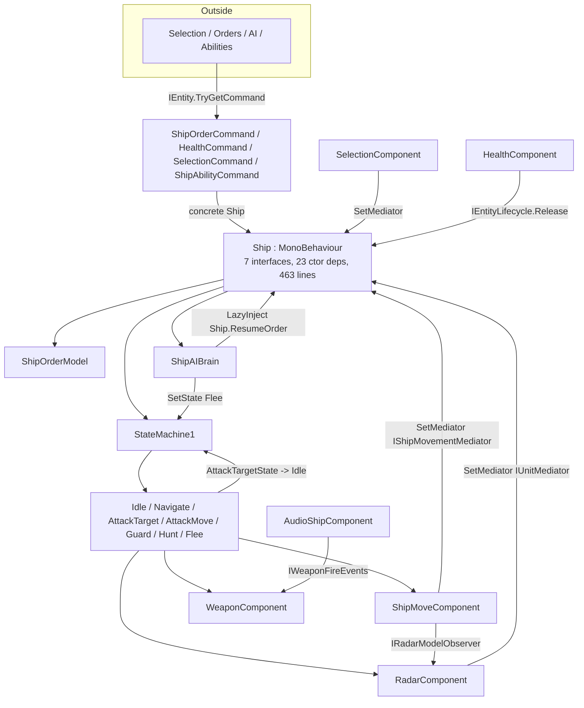

# Ship & Squadron entity analysis

**Date:** 2026-09-25 · **Revision:** `0efa88cb` (branch `fix/battle-related-bugs`) · **Scope:** `Ship`, `Squadron` and the components, states, commands and installers around them.
Static source review only. No code, assets or tests were changed or run.

**Yardstick:** simple, readable, correct code. SOLID / GRASP / GoF / Clean Architecture are used as checklists, not as goals. No use-case interactors, domain services or extra layers are recommended here.

Follow-up plan: [[TODOs/Ship_Squadron_Entity_Simplification_Plan]]

---

## 1. Short answers

| Question | Answer |
|---|---|
| Do components reference other components? | **Mostly no, with 6 exceptions.** The entity (`Ship` / `Squadron`) is the hub and holds every component. But some components still inject siblings, sibling models, or the entity itself (back-reference). See §3. |
| Is there a unified system to exchange data and behaviour between components? | **No.** There are **8 different channels** (DI of siblings, `SetMediator` callbacks, entity commands, C# events, observable models, per-tick polling, shared container models, `HealthModel.Transform` reach-through). Each one is reasonable alone; together nobody knows which to use. See §4. |
| Is there a clear, clean state machine? | **Ship: partially. Squadron: no state machine (switch on order type + pilot mode enum).** Ship has a correct tiny `StateMachine1`, but transitions are triggered from **4 places**, orders and states are two sources of truth, and states need `SetData` before `SetState`. See §5. |

---

## 2. What the entity looks like today

`Squadron` has the same outer shape (same commands, same `ShipOrderModel`, same `IUnitMediator`) but drives behaviour with `UpdateOrder()` switch + `SquadronPilot` (Travel / Loiter / Engage).

### What is already good — keep it

- **Per-entity Zenject context** (`DynamicEntityInstaller` → `ShipInstaller` / `SquadronInstaller`). Each unit is a small self-contained world. Good GRASP *Creator* / *Low Coupling*.
- **External boundary `IEntity` + `IEntityCommand`.** Outside code never sees `Ship`; it asks for `IMoveCommand`, `IHealthCommand`… This is the most important seam and it works for ships, squadrons, stations.
- **`EntityComponentLifecycle`** — one idempotent release loop.
- **Pure decision logic**: `ShipAiDecisionModel` + `ShipAiSnapshot`, `ShipOrderModel`, `SquadronTargetSelector`, `SquadronFormation`, `FighterManeuver`. Small, testable, no Unity lifecycle.
- **`SquadronPilot`** is a good *Pure Fabrication*: squadron decides *what*, pilot decides *how each fighter steers*, flight component *moves transforms*. Clear three-level split.
- **`ShipEngagement`** static helper removes duplicated range checks between states.
- Components expose interfaces (`IShipMoveComponent`, `IWeaponComponent`, `IRadarComponent`), so states depend on abstractions.

---

## 3. Component → component references

Rule of thumb used here: *a component may **read** sibling state through a read-only interface; it must not **command** a sibling or call back into its entity.* The entity is the only place that connects components.

| # | From → To | How | Verdict | Simple fix |
|---|---|---|---|---|
| 1 | `HealthComponent` → `Ship` (and `SquadronHealthComponent` → `Squadron`) | injects `IEntityLifecycle`, calls `Release()` on destroy | ❌ **Cycle** (entity → component → entity). Health decides entity death. | Health only raises `OnDestroy` (it already exists). Entity subscribes and releases itself. |
| 2 | `RadarComponent`, `SelectionComponent` → entity | `SetMediator(IUnitMediator)` after construction | ⚠️ Two-phase init, nullable `_mediator?.`, and `Components` namespace depends on `Entities.Ship.Mediator` (wrong direction). `Squadron` implements two methods as empty no-ops (ISP/LSP smell). | Replace with plain C# events on the component (`EnemyDetected`, `ContactsUpdated`, `SelectionChanged`). Entity subscribes in `Initialize`. |
| 3 | `ShipMoveComponent` → `Ship` | `SetMediator(IShipMovementMediator)`; includes query `GetFiringTurnAngle` that is forwarded to `WeaponComponent` | ⚠️ Hidden move→weapon dependency routed through Ship. | Events for `PositionChanged` / `Stopped` / `LookingAt`. For the query, inject a narrow read-only `IWeaponFacing` (1 method) directly — honest dependency. |
| 4 | `AudioShipComponent` → `WeaponComponent` | injects `IWeaponFireEvents` | ✅ Acceptable: narrow, read-only event interface. Keep. |
| 5 | `ShipMoveComponent`, `SquadronFlightComponent`, `ShipAbilityCommand` → Radar | inject `IRadarModelObserver` to read `Range` | ✅ Acceptable (read-only model). Better: put vision range into their own data. |
| 6 | `HangarComponent` → `HardPoint` view | polls `hangarHardPoint.IsDestroyed` every `Tick` | ⚠️ Gameplay rule reads a **view** object. | Subscribe to the hard point **model** destroyed event (`IHardPointModel.OnDestroyed`). |
| 7 | `ShipSfxPresenter` → `IShipMoveComponent`, `ShipMoveModel`, `IShipMoveData`, `IShipAbilityCommand` | DI | ⚠️ Reads the same movement state through 3 handles. | Depend on one read-only movement observer. |
| 8 | States → `IShipMoveComponent`, `IWeaponComponent`, `IRadarComponent` | DI | ✅ Expected — states are behaviour of the entity. |

Also noted:
- `IShipMoveComponent` has 15 members mixing movement, selection highlight (`HandleSelection`), radar contacts, speed modifier and mediator wiring → **fat interface (ISP)**.
- `entity.HealthModel.Transform.position` appears **31 times**. Position is reached through the health model (Law of Demeter / GRASP *Information Expert*). `IEntity` should expose `Position` itself.
- Installers use `FromComponentsInHierarchy` (15 uses) and `EntityLocator` uses `GetComponentInParent`. This conflicts with the AGENTS rule "no implicit lookups", but it is centralized in installers — low priority. If changed, use `[SerializeField]` fields on the entity prefab root + `FromInstance`.

---

## 4. Data & behaviour exchange — current channels

| Channel | Example | Keep? |
|---|---|---|
| A. DI of sibling component interface | states ← `IWeaponComponent`; `HealthCommand` ← `IHealthComponent` | ✅ inside entity only |
| B. `SetMediator` callbacks | Radar / Selection / Move → Ship | ❌ replace by D |
| C. Entity commands `TryGetCommand<T>` | UI/AI → `IMoveCommand` | ✅ the external API |
| D. C# events | `ShotEmitted`, `OnHardPointHealthChanged`, `Released`, `OnRelease` | ✅ component → entity notifications |
| E. Observable models | `RadarModel.Enemies` (`ObservableList`), `IHealthModelObserver` | ✅ read-only state |
| F. Per-tick push/poll | `Ship.SynchronizeComponents()` pushes position into radar; hangar polls view | ❌ read directly or use events |
| G. Shared container objects | `CombatModifiers`, `WeaponModel` | ✅ fine |
| H. Reach-through | `entity.HealthModel.Transform` | ❌ add `IEntity.Position` |

### Proposed unified rule (3 channels, nothing new to build)

1. **Outside → entity:** only `IEntity` + `IEntityCommand` (already true).
2. **Entity → component:** entity/states call methods on component interfaces (commands down).
3. **Component → entity:** C# events or read-only observer interfaces (notifications up). **No** `SetMediator`, **no** injecting the entity, **no** sibling commands.

This is plain *Mediator* + *Observer* — no event bus, no message types, no framework.

---

## 5. State machine

### Ship

`StateMachine1` itself is fine (Enter / Update / Exit, 30 lines). The problems are around it:

1. **Transitions come from 4 places.** `Ship` (17 `SetState` calls in order methods, `ResumeOrder`, `CompleteNavigation`, `Stop`), `ShipAIBrain` (Flee), `AttackTargetState` (to Idle, via `LazyInject<StateMachine1>` + `LazyInject<IdleState>`), and `Ship.Tick` (Guard/Hunt completion, Attack+Idle cleanup). To know "when does a ship stop attacking" you must read 3 files.
2. **Two sources of truth.** `ShipOrderModel.Current` and `StateMachine1.CurrentState` describe the same thing. `Ship.Tick` must cross-check combinations (`order == Attack && state == Idle → clear order`).
3. **Temporal coupling.** States are singletons; callers must remember `SetData` / `SetDestination` / `SetWorldDestination` **before** `SetState`. `NavigateState.Enter` throws if you forget.
4. **Duplicated order tail** in 7 order methods: `Replace order → Enable brain → SetData → if (!IsFleeing) SetState`. `ResumeOrder()` repeats the same order→state mapping a second time as a switch.
5. **Completion is inconsistent.** `GuardState.IsComplete`, `HuntState.IsComplete`, `AttackMoveState.IsEngaging` are checked from outside; `AttackTargetState` transitions itself; `NavigateState` completion is detected by `Ship.CompleteNavigation()` looking at move component flags.
6. **Flee is an override, not an order,** but it lives in the same state machine, so every order method needs `if (!_shipAIBrain.IsFleeing)`.
7. Minor: `IdleState.Enter` repeats `ResetTarget` already done by `Stop()`; `HuntState` / `ShipAIBrain` read `Time.deltaTime` directly instead of receiving `deltaTime`; unused API: `NavigateState.SetScreenDestination`, `IsTheSameWorldDestination`, `StateMachine1.ExitState` (0 external callers); `ShipAiDecision.Navigate/Attack` are produced but never acted on.

**Simple target (no new framework):**

- One owner of transitions: the `Ship` (or a small `ShipOrderRunner` if `Ship` is split). States never switch states.
- States report `bool IsComplete` uniformly (add to `IBaseState` or a ship-specific `IShipState`). `Ship.Tick`: `update state → if complete → StartNext()` (next waypoint or Idle).
- One method `StartOrder()` that maps `ShipOrderModel.Current` → configured state. Order methods become: `if same order return; _orders.Replace(...); StartOrder();`. `ResumeOrder()` becomes `StartOrder()`.
- Flee as an override flag checked in one place: `if (_brain.IsFleeing) run flee state else run order state`.
- Rename `StateMachine1` → `StateMachine`.

### Squadron

No state machine; `UpdateOrder()` is a `switch` on `ShipOrderType` with `_engaged` as an implicit sub-state, and `SquadronPilot.Mode` is a second implicit state. At ~300 lines this is **readable and acceptable** — do not force the ship state classes on it. Improvements only:

- Behaviour must match ship semantics for the same command: `Squadron.MoveTo/AttackMoveTo/Retreat` do not dedupe with `Matches` (Ship does); `Squadron.Attack` ignores `formationOffset`. Decide and document per-order semantics once.
- `ShipOrderModel`, `ShipOrderType`, `IUnitMediator` live in `Entities.Ship.*` but are used by `Squadron` → move to a neutral namespace (e.g. `Entities.BaseEntity.Orders`) or rename `UnitOrderModel`.

---

## 6. Principle checklist

| Principle | Status | Evidence / note |
|---|---|---|
| **SRP** | ❌ `Ship` | MonoBehaviour + `IController`, `IShipEntity`, `ITickable`, `IUnitMediator`, `IShipMovementMediator`, `IEntityLifecycle`; 23 constructor deps; orders, AI gating, death FX, audio forwarding, engine damage, radar sync. >200 lines rule triggered (463). Split **order/state handling** out; keep `Ship` as lifecycle + wiring. |
| | ⚠️ | `WeaponComponent` (449) and `CombatAttackCoordinator` (719) also exceed 200 lines — separate review. |
| **OCP** | ❌ | Adding one order touches: new `I…Command`, `ShipOrderType`, `Ship` method + `ResumeOrder` switch + `Tick` checks, `ShipOrderCommand`, `Squadron` + `UpdateOrder` + `ResumeCourse`, `SquadronOrderCommand`. The `StartOrder()` mapping reduces it to 1 place per entity. |
| **LSP** | ⚠️ | `Squadron : IUnitMediator` with empty `HandleRadarContacts` / `OnSelect`. |
| **ISP** | ⚠️ | `IShipMoveComponent` (15 members), `IUnitMediator`. `ShipOrderCommand` implementing 8 tiny command interfaces is **fine** — it is the ISP-friendly side. |
| **DIP** | ⚠️ | `ShipAIBrain` → `LazyInject<Ship>` (concrete + lazy to hide cycle); `ShipOrderCommand` → concrete `Ship`; `Components/*` → `Entities.Ship.Mediator` (low-level depends on high-level). |
| **GRASP Controller** | ✅ | `Ship` / `Squadron` receive system events. Overloaded, but correct role. |
| **GRASP Information Expert** | ⚠️ | Position via `HealthModel.Transform`; engine-damage slowdown handled in `Ship` by scanning hard points instead of health/move owning it. |
| **GRASP Low coupling / High cohesion** | ⚠️ | Good inside squadron (pilot / selector / flight). Ship spreads one concept (current order) across 4 classes. |
| **GRASP Pure Fabrication** | ✅ | `SquadronPilot`, `SquadronTargetSelector`, `ShipEngagement`, `AttackDataFactory`. |
| **GoF State** | ⚠️ | Present but states trigger their own transitions and need pre-configuration. |
| **GoF Mediator** | ⚠️ | `Ship` is the mediator, but components also bypass it (§3 #1, #3). |
| **GoF Observer** | ✅ | C# events + observable models, consistent with AGENTS. |
| **GoF Command** | ℹ️ | `IEntityCommand` types are really *capability interfaces* (a facade per ability), not request objects. Naming is fine to keep; just don't expect undo/queueing semantics. |
| **GoF Factory** | ✅ | `SquadronFactory`, `AttackDataFactory`, installers. |
| **Clean Arch – dependency rule** | ⚠️ | Pure models are good. Violations: component namespace depends on entity namespace; states/brain read `Time.deltaTime`. No need for more layers. |
| **Fail fast / no silent null** | ⚠️ | `_audioDialogShipComponent?.` (5×, optional by player type — acceptable but a no-op `NullDialog` bound for opponents would be cleaner) and `_mediator?.OnSelect` in `SelectionComponent`. |

---

## 7. Small correctness / readability notes found on the way

- `Ship.Release`: two consecutive `if (playDeathEffects)` blocks — merge.
- `AttackTargetState.Enter`: if the target has no `IHealthCommand`, weapons get no target and the state stays active doing movement only. Should fall back to Idle (or fail fast).
- `MonoComponent.Id` is marked `// remove this`; `Controller` / `Command` base classes and `IController.GetModel()` exist mostly for the entity base type constraint.
- `SquadronPilot.GetRadius` scans all hard points each call and is used by both `Squadron` and pilot — fine now, cache if profiling shows it.

Related: [[SCRIPTS_CODE_AUDIT_2026-09-12]], [[TODOs/Ship_Movement_Simplification_Plan]], [[TODOs/SHIP_ACTIONS_PLAN]].
