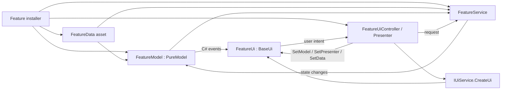

# UI Refactoring Playbook

This document is the instruction for fixing and refactoring a feature UI in this project. It records the approach used for `ReinforcementUi` and turns it into a repeatable flow for the next specific UI.

Always read [`PROJECT_ORGANIZATION.md`](./PROJECT_ORGANIZATION.md) before applying this playbook. Its placement rules remain authoritative.

## Goal

Refactor a feature into explicit Model-View-Presenter responsibilities:

| Part | Responsibility | Must not contain |
| --- | --- | --- |
| `<Feature>Data : Data` | Serialized configuration, prefab mappings, read-only lookup API | Runtime state, event subscriptions, gameplay flow |
| `<Feature>Model : PureModel` | Runtime state, rules, and C# events | `UnityEngine`, `[SerializeField]`, `ScriptableObject`, prefab creation |
| `<Feature>Ui : BaseUi` | Render state and forward user input | Gameplay rules, service orchestration, implicit Zenject feature dependencies |
| `I<Feature>Presenter` | UI intent API | `ICommand` unless it is a real command object |
| `<Feature>UiController` | Create the UI, pass all dependencies through methods, initialize and dispose it | Gameplay implementation |
| `<Feature>Service : Service` | Gameplay/application flow and interaction with non-UI systems | `UiService`, `BaseUi`, UI prefab creation, UI event rendering |

## Apply This Refactor When

Use this flow when one or more of these conditions are true:

- Zenject throws `Unable to resolve ...` while a UI prefab is being created in a different container or subcontainer.
- A UI inherits `BaseUi<TModel>` or `BaseUi<TModel, TCommand>` and depends on feature bindings that are not visible to the UI factory.
- A model is a `ScriptableObject` that mixes serialized configuration with mutable runtime state and events.
- A controller creates or updates UI and also performs gameplay work.
- A service depends on `IUiService`, a concrete UI, `BaseUi`, or UI-only types.
- An interface named `I...Command` only forwards UI intent and does not represent an executable command object.

Do not perform the whole refactor for a missing Inspector reference or a local rendering bug when the existing architecture already satisfies the boundaries above. Fix the narrow bug in that case.

## Target Flow



The important container boundary is at UI creation. The prefab may be created by a parent UI factory, but its feature dependencies are supplied afterward by `<Feature>UiController` through explicit methods.

## Required Refactoring Order

Follow this order. Do not delete the old model asset before the data migration is verified.

### 1. Reproduce and map the current feature

Before editing:

1. Record the exact exception or incorrect behavior.
2. Find the UI prefab, its `UiType`, the UI factory, and the installer that owns the feature.
3. List every model field and classify it using the table below.
4. List every controller dependency and mark it as UI, gameplay, configuration, or infrastructure.
5. Record the current asset path, GUID, Addressables entry, and repository mapping when applicable.

If `graphify-out` gives a precise source path, use it to find the dependency chain. If it returns package noise or cannot prove the edge, inspect the current source directly and do not invent graph relationships.

| Existing member | Destination |
| --- | --- |
| `[SerializeField]` configuration | `<Feature>Data` |
| Serialized dictionary wrapper | Encapsulate inside `<Feature>Data`; expose a lookup method |
| Mutable runtime value | `<Feature>Model` |
| Runtime rule or state transition | `<Feature>Model` |
| C# state event | `<Feature>Model` observer API |
| Unity widget or scene reference | `<Feature>Ui` |
| UI input intent | `I<Feature>Presenter` |
| UI creation and lifecycle | `<Feature>UiController` |
| Gameplay flow or external-system coordination | `<Feature>Service` |

### 2. Create `<Feature>Data` first

Create the class under `Assets/Scripts/Entities/<Feature>`:

```csharp
[CreateAssetMenu(fileName = nameof(FeatureData), menuName = "Data/Feature Data")]
public class FeatureData : Data
{
    [SerializeField] private DictionaryWrapper<Key, Value> values;

    public Value GetValue(Key key)
    {
        // Keep serialized representation private and expose a focused API.
    }
}
```

Rules:

- Move every serialized data field from the old model into this class.
- Keep dictionary wrappers private. Do not expose the mutable dictionary.
- Move safe configuration lookup methods with the fields they query. `GetSpawnPrefab` is the Reinforcement example.
- Do not move mutable match/session state into the data asset.
- Place the asset under `Assets/Settings/Data/<Feature>`.

### 3. Migrate the asset through Unity-aware tooling

Use Unity MCP or the Unity Editor so asset metadata and object references remain valid.

1. Create the new `<Feature>Data` asset.
2. Read the old model asset properties.
3. Dry-run the complete property patch when the Unity tool supports it.
4. Copy every serialized value and object reference.
5. Re-read the new asset and compare the complete serialized payload.
6. Update repository and Addressables mappings without changing the structure of `Assets/AddressableAssetsData`.
7. Reimport and confirm there are no related console errors.
8. Only after all checks pass, remove the old model asset through Unity-aware tooling.

Stop the migration if any field, list element, dictionary key, object reference, GUID mapping, or Addressables entry cannot be verified.

### 4. Refactor the model to `PureModel`

The model becomes a constructor-injected pure C# object:

```csharp
public class FeatureModel : PureModel, IFeatureModelObserver
{
    private readonly FeatureData _data;

    public FeatureModel(FeatureData data)
    {
        _data = data;
    }
}
```

Required conditions:

- It inherits `PureModel`.
- It has no `[CreateAssetMenu]` and no `[SerializeField]` members.
- It is not instantiated as a Unity asset.
- Dependencies are supplied through the constructor.
- It owns runtime values, rules, and plain C# events.
- Its public observer interface exposes only what the view needs to observe or query.

The current `Data` base is a `ScriptableObject`, so a `PureModel` may receive data through its constructor even though the model itself remains free of Unity lifecycle and serialization behavior. Do not call Unity APIs from the model.

### 5. Split gameplay from UI

Rename the old gameplay controller to `<Feature>Service` when it primarily performs application/gameplay work.

The service may depend on:

- `<Feature>Model`
- `<Feature>Data`
- input, camera, entity factories, repositories, or other gameplay services

The service must not depend on:

- `IUiService`
- `BaseUi` or a concrete feature UI
- UI widgets
- UI creation or UI disposal
- UI-only presenter lifecycle

If a method only changes visuals, move it to the view. If it receives UI input and decides which gameplay request to make, put the decision/forwarding in the presenter. If it implements the actual gameplay request, keep it in the service.

### 6. Rename a false command to a presenter

When `I<Feature>Command` is only the API called by the view, rename it to `I<Feature>Presenter` and remove the `ICommand` inheritance.

```csharp
public interface IFeaturePresenter
{
    void HandleUserRequest(string id);
}
```

Do not retain `ICommand` just to satisfy `BaseUi<TModel, TCommand>`. The view will no longer inherit that generic base.

### 7. Make the view inherit non-generic `BaseUi`

The view receives feature dependencies through explicit setup methods:

```csharp
public interface IFeatureUi
{
    void SetModel(IFeatureModelObserver model);
    void SetPresenter(IFeaturePresenter presenter);
    void SetData(FeatureData data);
    void Initialize();
    void Dispose();
}

public class FeatureUi : BaseUi, IFeatureUi
{
    // Serialized fields are Inspector-owned view references only.
}
```

Required conditions:

- Inherit `BaseUi`, not `BaseUi<TModel>` or `BaseUi<TModel, TCommand>`.
- Do not use Zenject property injection for feature model, presenter, or data dependencies.
- Provide dependencies through methods before `Initialize()`.
- Validate all required dependencies at the start of `Initialize()` and throw a clear error if one is missing.
- Subscribe to model events and Unity controls only in `Initialize()`.
- Unsubscribe symmetrically in `Dispose()`.
- Make `Dispose()` safe when called more than once.
- Call `Dispose()` from `OnDestroy()` as a lifecycle safety net.
- Keep the view limited to rendering and forwarding input.

The required setup order is:

```text
Create UI -> SetModel -> SetPresenter -> SetData (if needed) -> Initialize
```

Do not call `Initialize()` from `Awake` or `Start` when dependencies are supplied after prefab creation.

### 8. Add `<Feature>UiController`

The UI controller is the presenter and owns the dynamically created UI lifecycle:

```csharp
public class FeatureUiController : IFeaturePresenter, IInitializable, ILateDisposable
{
    public void Initialize()
    {
        BaseUi ui = _uiService.CreateUi(UiType.Feature);
        _ui = ui as IFeatureUi
            ?? throw new InvalidOperationException(
                "The feature prefab does not implement IFeatureUi.");

        _ui.SetModel(_model);
        _ui.SetPresenter(this);
        _ui.SetData(_data);
        _ui.Initialize();
    }

    public void LateDispose()
    {
        _ui?.Dispose();
    }
}
```

Rules:

- `IUiService.CreateUi` must return the created `BaseUi` so the controller can configure it.
- Cast to the feature UI interface and fail immediately with a useful prefab error.
- The controller forwards UI requests to the service.
- The controller does not reimplement gameplay rules.
- Only one owner creates and initializes this feature UI.

### 9. Bind the final object graph

Bind all feature objects in the installer that owns their gameplay lifetime:

```csharp
Container.BindScriptableObject<FeatureData>(Repository);
Container.BindInterfacesAndSelfTo<FeatureModel>().AsSingle();
Container.BindInterfacesNonLazyExt<FeatureService>();
Container.BindInterfacesNonLazyExt<FeatureUiController>();
```

Use the project binding extensions that match the type. A `PureModel` may not satisfy a helper constrained to the old Unity `Model` base, so bind it directly when required.

The installer must be able to resolve the data, model, service, and UI controller in one feature scope. The created UI prefab itself does not need to resolve those feature bindings because the controller supplies them explicitly.

## Reinforcement Reference Implementation

The Reinforcement refactor is the concrete example for this playbook:

| Before | After |
| --- | --- |
| Serialized `ReinforcementModel` asset | `ReinforcementData : Data` asset under `Assets/Settings/Data/Reinforcement` |
| Model mixed configuration and runtime state | `ReinforcementModel : PureModel` with constructor-injected `ReinforcementData` |
| `ReinforcementController` mixed responsibilities | `ReinforcementService` for gameplay flow |
| `IReinforcementCommand : ICommand` | `IReinforcementPresenter` without `ICommand` |
| Generic injected `ReinforcementUi` | `ReinforcementUi : BaseUi` with explicit setup methods |
| UI created from gameplay controller/service | `ReinforcementUiController` creates, configures, initializes, and disposes it |
| `IUiService.CreateUi` returned nothing | It returns the created `BaseUi` |

Reinforcement dependency flow:

```text
PlayerCoreInstaller
  -> ReinforcementData
  -> ReinforcementModel(data)
  -> ReinforcementService(model, data, gameplay dependencies)
  -> ReinforcementUiController(uiService, service, model, data)
       -> CreateUi(UiType.Reinforcement)
       -> SetModel(model)
       -> SetPresenter(controller)
       -> SetData(data)
       -> Initialize()
```

The original resolution failure occurred because the generic UI base requested feature dependencies during prefab construction in a container that could not resolve them. Explicit setup after `CreateUi` removes that hidden container-scope requirement.

## Verification Checklist

Run the narrowest reliable checks in this order:

- [ ] The original UI exception or bug is reproducible before the change.
- [ ] The new data asset exists before the old model asset is removed.
- [ ] Every serialized field and object reference matches the old asset.
- [ ] Repository and Addressables mappings point to the new data asset.
- [ ] `<Feature>Model` inherits `PureModel` and contains no Unity serialization attributes.
- [ ] `<Feature>Service` has no UI dependency or UI creation code.
- [ ] `I<Feature>Presenter` does not inherit `ICommand`.
- [ ] `<Feature>Ui` inherits non-generic `BaseUi`.
- [ ] All required view dependencies are passed through methods before `Initialize()`.
- [ ] Every subscription added in `Initialize()` is removed in `Dispose()`.
- [ ] The UI prefab implements `I<Feature>Ui`.
- [ ] The feature installer resolves data, model, service, and UI controller.
- [ ] A focused test can create/inject the UI prefab without resolving feature dependencies from the prefab container.
- [ ] Scripts compile and Unity console contains no new related errors.
- [ ] Play Mode verifies creation, input forwarding, model events, rendering, and disposal.
- [ ] The final diff contains no unrelated formatting, asset, scene, or user-layout changes.

If full scene validation is blocked by an unrelated pre-existing installer or scope error, document the exact blocker and keep it outside this refactor. Do not broaden the change unless requested.

## Common Failure Modes

- **Deleting the model asset first:** serialized values or references become unrecoverable. Create, copy, compare, remap, then delete.
- **Keeping the generic `BaseUi` inheritance:** Zenject still tries to inject feature dependencies during prefab construction.
- **Calling `Initialize()` too early:** setup methods have not supplied the required dependencies.
- **Leaving UI creation in the service:** the gameplay layer remains coupled to UI lifetime and factory scope.
- **Moving mutable state into `Data`:** the shared ScriptableObject becomes runtime session state.
- **Exposing dictionary wrappers:** callers can mutate configuration instead of using a focused lookup API.
- **Keeping `ICommand` on a presenter:** an unrelated abstraction controls the view hierarchy and DI shape.
- **Subscribing twice or not disposing:** callbacks duplicate or target destroyed views.
- **Editing `.asset` YAML or `.meta` files manually:** object references or GUIDs can be lost. Use Unity-aware tooling.
- **Changing `Assets/AddressableAssetsData` structure:** this violates project organization constraints.
- **Fixing unrelated scene binding failures:** it expands scope and makes verification ambiguous.

## Per-UI Work Record

Copy this section into the task notes before refactoring the next UI:

```text
Feature/UI:
Observed exception or bug:
Reproduction steps:
UI prefab and UiType:
UI creation path/container:
Owning installer and scope:
Current model asset path/GUID:
Serialized fields moving to Data:
Runtime fields staying in Model:
Lookup API moving to Data:
Current controller responsibilities:
Gameplay dependencies moving to Service:
UI lifecycle moving to UiController:
Command interface renamed to Presenter:
New Data asset path/GUID:
Repository/Addressables mappings:
Focused verification:
Play Mode verification:
Unrelated blockers:
```

The refactor is complete only when every applicable verification item passes and the original UI bug no longer reproduces.
