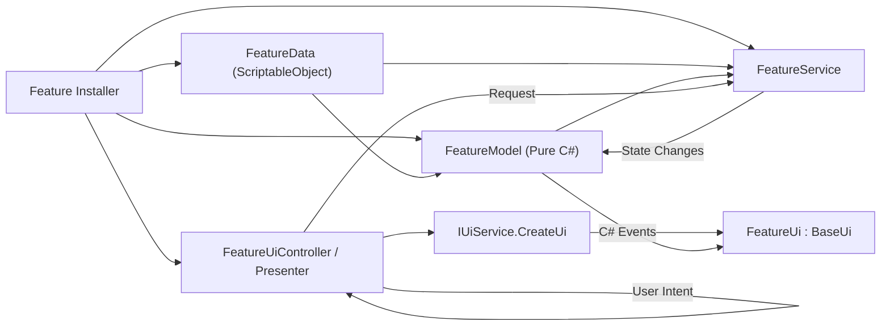

# Empire At War (Unity 6 Project)

An RTS-inspired space-battle game featuring faction control, reinforcement systems, customizable ship behaviors, and economy management. The codebase is heavily structured around strict architectural boundaries (MVP) and integrates advanced developer tools like Model Context Protocol (MCP) and Graphify to support AI-assisted development.

---

## 🚀 Technology Stack

* **Game Engine:** **Unity 6** (Editor Version `6000.4.7f1`)
* **Dependency Injection:** **Zenject** (Extenject) for clean binding lifecycles, project/scene contexts, and factory patterns.
* **Rendering:** **Universal Render Pipeline (URP)** (`17.4.0`) for optimized visual performance.
* **Asset & Data Management:** **Addressables** (`2.9.1`) for dynamic loading of prefabs, visual assets, and databases via the `AddressableRepository`.
* **Input System:** Unity's **New Input System** (`1.19.0`) for scalable cross-platform controls.
* **Animation Engine:** **DOTween** for smooth UI transitions and procedural visual effects.
* **Agent Toolkit & AI Integrations:**
  * **Unity MCP (`com.coplaydev.unity-mcp`):** An in-editor Model Context Protocol server that exposes Unity runtime and editor tools directly to AI coding assistants.
  * **Graphify:** A codebase semantic indexing tool used to map dependency trees and query the project graph.

---

## 🏛️ Architecture (Model-View-Presenter)

The codebase strictly enforces the **Model-View-Presenter (MVP)** pattern to decouple gameplay business rules from Unity-specific APIs and rendering lifecycles.

---

## 📖 Developer Guides

- [[../Architecture/PROJECT_ORGANIZATION|PROJECT_ORGANIZATION.md]]: Mandatory folder structures and asset placement rules.
- [[../Architecture/UI_REFACTORING_PLAYBOOK|UI_REFACTORING_PLAYBOOK.md]]: Detailed checklists and Mermaid flows for migrating UI/features to clean MVP structures.
- [[../Architecture/GRAPHIFY_GUIDE|GRAPHIFY_GUIDE.md]]: Guide on installing and using `graphify` to build, query, and traverse codebase dependencies.
- [[AGENTS|AGENTS.md]]: Shared instructions, behaviors, and patterns for AI coding assistants.
