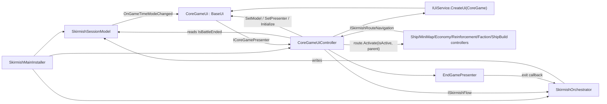

---
tags:
  - plan
  - refactor
  - ui
  - core-game
status: proposed
created: 2026-09-23
executor: codex
---
# SkirmishOrchestrator Refactoring Plan

> **Executor:** Codex. **Status:** proposed and awaiting user approval.
> Read these notes first: [[Rules/UI_CODE_BUILD_GUIDE]], [[Architecture/UI_REFACTORING_PLAYBOOK]], [[Rules/UI_UX_GUIDELINES]], and `AGENTS.md`.
> Do not run tests unless the user explicitly asks. Change assets through Unity-aware tooling only.

## 1. Goal

`SkirmishOrchestrator` is the main imperative entity for the skirmish. It owns the core game flow: the opening camera, game time, the pause menu and exit state, the end of the battle, and leaving the skirmish.

The refactor must:

1. Remove the `Controller<CoreGameData>` inheritance.
2. Remove the `CoreGameData` dependency, then delete the `CoreGameData` type and asset.
3. Move all UI work and UI routing out of `SkirmishOrchestrator`. This covers `IUiService`, `CoreGameUi`, `EndGamePresenter` creation, `ISelectionService`-driven content visibility, and `ISkirmishRouteNavigation`.
4. Add a dedicated `CoreGameUiController` that follows the UI Code Build Rule. It creates and owns `CoreGameUi` and **implements the skirmish route system** (`ISkirmishRouteNavigation`).
5. Change `CoreGameUi` from the generic, Zenject-injected `BaseUi<ICoreGameModelObserver, ICoreGameCommand>` to the non-generic `BaseUi` with explicit setup methods.

Out of scope: `EndGameUi` and `EndGamePresenter` internals (only their owner changes), `MenuController`, the route consumers' logic, prefab layout, and `GameTimeMode` placement.

## 2. Current state (verified 2026-09-23)

### Files

| File | Role today |
| --- | --- |
| `Assets/Scripts/Entities/CoreGame/Controller/SkirmishOrchestrator.cs` | `Controller<CoreGameData>`, `ICoreGameCommand`, `ISkirmishRouteNavigation`, observes `UserNotifierState`, `ISelectionSubject`, and `BattleResult`. 385 lines. |
| `Assets/Scripts/Entities/CoreGame/Model/CoreGameData.cs` | A `ScriptableObject` (`Data, IModel`) used as mutable runtime state: `GameTimeMode` and `IsContentVisible`, plus events. It also declares `ICoreGameModelObserver`, a second top-level type in the same file. |
| `Assets/Scripts/Components/Commands/SkirmishGame/ICoreGameCommand.cs` | A false command (`: ICommand`) with `Play`, `SpeedUp`, and `ToggleReinforcement`. |
| `Assets/Scripts/Entities/CoreGame/Ui/CoreGameUi.cs` | `BaseUi<ICoreGameModelObserver, ICoreGameCommand>, IInitializable, ILateDisposable`. The model and command are property-injected by Zenject. |
| `Assets/Scripts/Entities/CoreGame/Controller/EndGamePresenter.cs` | Plain presenter. Takes the `IEndGameView` that `CoreGameUi.PrepareEndGameView` returns and an exit callback. |
| `Assets/Scripts/Services/UiRouting/ISkirmishUiRoute.cs` | `SkirmishUiRoutePosition`, `ISkirmishUiRoute`, and `ISkirmishRouteNavigation`. This refactor does not change these contracts. |
| `Assets/Scripts/Services/SceneContext/Skirmish/SkirmishMainInstaller.cs` | Contains `BindModel<CoreGameData>(Repository)` and `BindInterfacesNonLazyExt<SkirmishOrchestrator>()`. |
| `Assets/Settings/Data/Models/SkirmishGame/CoreGameData.asset` | The `CoreGameData` asset (GUID `c7c667c14d310a4499d62638ddd5c2f8`). |
| `Assets/AddressableAssetsData/AssetGroups/Model.asset` | Addressable entry with address `CoreGameData`. |
| `Assets/Settings/AssetMappingData.asset` | Mapping key `CoreGameData` (around line 192) and key `CoreGameUi` (around line 514; keep this one). |

### `ISkirmishRouteNavigation` consumers (their contract must not change)

- `ShipUiController` (Content), in `SkirmishMainInstaller`
- `MiniMapController` (MiniMap), in `SkirmishMainInstaller`
- `EconomyUiController` (Economy), in `PlayerCoreInstaller`
- `ReinforcementUiController` (Reinforcement), in `PlayerCoreInstaller`. It calls `SetRouteActive(Reinforcement, false)` **before** `RegisterRoute`, and possibly before the core UI exists.
- `FactionUiController` and `ShipBuildUiController` (BuildPipeline), in `PlayerCoreInstaller`

`PlayerCoreInstaller` resolves `ISkirmishRouteNavigation` from the parent scene container. **The new controller must therefore be bound in `SkirmishMainInstaller`.**

### Behaviour that must be preserved

1. **Route buffering:** routes can register and change state before `CoreGameUi` exists. When the UI is created, every buffered route is activated with its stored state. A route position with no stored state defaults to active.
2. **Route activation after the UI exists:** `RegisterRoute` activates immediately, `UnregisterRoute` deactivates and then removes, and `SetRouteActive` activates or deactivates every route at that position.
3. **Content visibility:** the content panel shows only when the Content route is active and the player's selection is either a `Base` or a `Ship` selection that contains at least one entity that is not destroyed and has an `IMoveCommand`. The panel updates when `SetRouteActive(Content, …)` is called and when the player's selection changes (`selectionSubject.UpdatedType == PlayerType.Player`).
4. **Ship group layout:** `SetShipGroupLayout(context != null && HasSelectable && SelectionType == Ship && Count > 1)` runs on every content visibility update, including the initial update with a `null` selection.
5. **Time controls:**
   - `Play`: Common or SpeedUp becomes Pause, and Pause becomes Common.
   - `SpeedUp`: Common becomes SpeedUp, SpeedUp becomes Common, and Pause becomes SpeedUp.
   - The time scales are 1, 4, and 0.
   - Both actions do nothing after the battle ends.
6. **ToggleReinforcement:** flips the active state of the Reinforcement route. It does nothing after the battle ends.
7. **User state:** `ExitGame` leads to `ExitSkirmish`. Otherwise, once the battle has ended, nothing happens. `InMenu` sets the time scale to Pause and any other state sets it to Common. **Note:** this path changes the time scale without changing the stored `_gameTimeMode`, and the model receives the applied mode. Keep that exact semantics.
8. **Battle end:** `_hasBattleEnded = true`, then pause.
9. **Exit:** set the mode to Common, then call `IGameCommand.ExitGame()`.
10. **End game view:** `EndGamePresenter` receives `CoreGameUi.PrepareEndGameView(IUiService.PopupCanvasTransform)` and an exit callback. It is disposed on teardown.
11. **Initial camera:** `ICameraService.MoveTo(IMapModelObserver.GetStationPosition(playerFaction))`.
12. **Teardown:** on `LateDispose`, all routes are deactivated if the UI exists and then cleared.

### Known issues to fix as part of the refactor

- The time mode is applied in the `SkirmishOrchestrator` constructor (`ChangeTime` runs in the ctor and writes `Time.timeScale`). Move it to `Initialize()`.
- `CoreGameUi.Initialize` never renders the current time mode (it only reacts to change events), so the sprites can be stale at startup. The new view `Initialize()` must render `model.GameTimeMode` once.
- `CoreGameData.cs` declares two top-level types. The new files must follow the one-type-per-file rule.

## 3. Target design

### Responsibilities (MVP)

| Part | Type | Responsibility | Must not contain |
| --- | --- | --- | --- |
| Model | `SkirmishSessionModel : PureModel, ISkirmishSessionModelObserver` | Runtime session state: `GameTimeMode`, `IsBattleEnded`, and change events | Unity API, serialization, UI |
| Orchestrator | `SkirmishOrchestrator : ISkirmishFlow, IInitializable, ILateDisposable, IObserver<UserNotifierState>, IObserver<BattleResult>` | Core game flow: initial camera, time mode transitions and `Time.timeScale`, pause for the menu, battle end, exit | `IUiService`, `BaseUi`, `CoreGameUi`, routes, selection, `Controller<>`, `CoreGameData` |
| Flow API | `ISkirmishFlow` | Game-flow intents that UI presenters may request: `TogglePause()`, `ToggleSpeedUp()`, `ExitSkirmish()` | UI types |
| Presenter intent | `ICoreGamePresenter` | View intent: `Play()`, `SpeedUp()`, `ToggleReinforcement()` | `ICommand` |
| UI controller | `CoreGameUiController : ICoreGamePresenter, ISkirmishRouteNavigation, IObserver<ISelectionSubject>, IInitializable, ILateDisposable` | Creates and configures `CoreGameUi`, owns the route registry, content visibility and ship group layout, and the `EndGamePresenter` lifecycle. Forwards time intents to `ISkirmishFlow`. | `Time.timeScale`, game-flow rules, camera, `IGameCommand` |
| View interface | `ICoreGameUi` | Setup and rendering API that the controller uses | — |
| View | `CoreGameUi : BaseUi, ICoreGameUi` | Renders time sprites, content panel visibility, and ship group layout. Exposes route parents and prepares the end game view. Forwards button clicks. | Zenject injection, gameplay rules |

### Dependency graph



There is no dependency cycle. The orchestrator depends on no UI type, and the UI controller depends on the orchestrator only through `ISkirmishFlow`.

### Final public contracts

```csharp
// Assets/Scripts/Entities/CoreGame/Model/ISkirmishSessionModelObserver.cs
namespace EmpireAtWar.Models.SkirmishGame
{
    public interface ISkirmishSessionModelObserver
    {
        event Action<GameTimeMode> OnGameTimeModeChanged;
        GameTimeMode GameTimeMode { get; }
        bool IsBattleEnded { get; }
    }
}

// Assets/Scripts/Entities/CoreGame/Model/SkirmishSessionModel.cs
public class SkirmishSessionModel : PureModel, ISkirmishSessionModelObserver
{
    public event Action<GameTimeMode> OnGameTimeModeChanged;
    public GameTimeMode GameTimeMode { get; private set; }
    public bool IsBattleEnded { get; private set; }

    public void SetGameTimeMode(GameTimeMode mode)  // always raises the event (matches the current setter)
    public void MarkBattleEnded()
}

// Assets/Scripts/Entities/CoreGame/Controller/ISkirmishFlow.cs
namespace EmpireAtWar.Controllers.Game
{
    public interface ISkirmishFlow
    {
        void TogglePause();
        void ToggleSpeedUp();
        void ExitSkirmish();
    }
}

// Assets/Scripts/Entities/CoreGame/Ui/ICoreGamePresenter.cs
namespace EmpireAtWar.Presenters.Game
{
    public interface ICoreGamePresenter
    {
        void Play();
        void SpeedUp();
        void ToggleReinforcement();
    }
}

// Assets/Scripts/Entities/CoreGame/Ui/ICoreGameUi.cs
namespace EmpireAtWar.Views.Game
{
    public interface ICoreGameUi
    {
        void SetModel(ISkirmishSessionModelObserver model);
        void SetPresenter(ICoreGamePresenter presenter);
        void Initialize();
        void Dispose();
        void SetContentVisible(bool isVisible);
        void SetShipGroupLayout(bool isShipSelection);
        Transform GetRouteParent(SkirmishUiRoutePosition position);
        IEndGameView PrepareEndGameView(Transform parent);
    }
}
```

The namespaces follow the existing conventions: `Models.SkirmishGame`, `Controllers.Game`, and `Views.Game`. `Presenters.Game` mirrors `Presenters.Reinforcement`.

## 4. Implementation phases

Complete each phase and confirm that it compiles (Unity `recompile` plus a console check) before starting the next. Use Serena for symbol edits and references.

### Phase 0: Baseline

1. `git status` to note the pre-existing dirty files. Do not touch unrelated changes. The working tree already has many modified prefabs and scripts.
2. Run `unity command list_open_scenes --json` and record the scene state. Do not open or save scenes.
3. Confirm the project compiles and the console has no errors before you edit anything. Record any errors already present so you can tell them apart from new ones.
4. Search with Serena, not text, for all references to `CoreGameData`, `ICoreGameModelObserver`, `ICoreGameCommand`, `SkirmishOrchestrator`, and `CoreGameUi`. The expected set is the files in §2 plus `SerializedReferenceTests` and `UiCanvasArchitectureTests`. Stop and report if there are any others.

### Phase 1: Add the new model and contracts (additive only)

Create these files, one type per file, each with a `.meta` file generated by Unity import:

1. `Assets/Scripts/Entities/CoreGame/Model/ISkirmishSessionModelObserver.cs`
2. `Assets/Scripts/Entities/CoreGame/Model/SkirmishSessionModel.cs`
   - Inherits `PureModel` and has no `UnityEngine` using.
   - `SetGameTimeMode` assigns the mode and **always** invokes `OnGameTimeModeChanged` (this preserves the current `CoreGameData` setter semantics).
   - `MarkBattleEnded` sets `IsBattleEnded = true`.
   - The initial `GameTimeMode` is `GameTimeMode.Common`, set explicitly in the constructor or field initializer.
3. `Assets/Scripts/Entities/CoreGame/Controller/ISkirmishFlow.cs`
4. `Assets/Scripts/Entities/CoreGame/Ui/ICoreGamePresenter.cs`
5. `Assets/Scripts/Entities/CoreGame/Ui/ICoreGameUi.cs`

Verify: the project compiles.

### Phase 2: Refactor `CoreGameUi` into a passive view

Edit `Assets/Scripts/Entities/CoreGame/Ui/CoreGameUi.cs`:

1. Change the declaration to `public class CoreGameUi : BaseUi, ICoreGameUi`. Remove `IInitializable`, `ILateDisposable`, and the `Zenject` using.
2. Add these private fields: `ISkirmishSessionModelObserver _model;`, `ICoreGamePresenter _presenter;`, and `bool _isInitialized;`.
3. Add `SetModel` and `SetPresenter` as plain assignments.
4. In `Initialize()`:
   - Throw `InvalidOperationException` if `_model` or `_presenter` is null (use the style of `ReinforcementUi`).
   - Keep the existing content-scroll reference validation.
   - Add the button listeners: `timeButton` calls `_presenter.Play`, `speedUpButton` calls `_presenter.SpeedUp`, and `reinforcementButton` calls `_presenter.ToggleReinforcement`.
   - Subscribe with `_model.OnGameTimeModeChanged += UpdateSprites;`.
   - Call `UpdateSprites(_model.GameTimeMode);` once to render the initial state (fixes the stale-sprite issue).
   - Set `_isInitialized = true;`.
5. `Dispose()` returns early if not initialized. Otherwise it removes the same listeners and subscription and sets `_isInitialized = false`.
6. `OnDestroy()` calls `Dispose()`.
7. Replace the model-driven content visibility with `public void SetContentVisible(bool isVisible) => panelImage.gameObject.SetActive(isVisible);`. Remove `HandleContentVisibilityChanged` and `SetContentPanelVisible`.
8. Keep `SetShipGroupLayout`, `GetRouteParent`, and `PrepareEndGameView` unchanged.
9. **Do not rename any `[SerializeField]` field.** `SerializedReferenceTests` and the prefab depend on the current names.
10. The file is about 155 lines today. If it grows past 200 lines, report it. Do not split it without approval.

The view must not initialize itself in `Awake` or `Start`.

### Phase 3: Add `CoreGameUiController`

Create `Assets/Scripts/Entities/CoreGame/Ui/CoreGameUiController.cs` in namespace `EmpireAtWar.Presenters.Game`:

```text
public class CoreGameUiController : ICoreGamePresenter, ISkirmishRouteNavigation,
    IObserver<ISelectionSubject>, IInitializable, ILateDisposable
```

Constructor dependencies (assign directly, with no null guards, per `AGENTS.md`):
- `IUiService uiService`
- `ISelectionService selectionService`
- `ISkirmishSessionModelObserver sessionModel`
- `ISkirmishFlow skirmishFlow`
- `INotifier<BattleResult> battleVictoryNotifier` (for `EndGamePresenter`)

Fields: `_routes` (`Dictionary<SkirmishUiRoutePosition, List<ISkirmishUiRoute>>`), `_routeStates` (`Dictionary<SkirmishUiRoutePosition, bool>`), `ICoreGameUi _ui`, `EndGamePresenter _endGamePresenter`, and `ISelectionContext _lastSelectionContext`.

`Initialize()`, in this order:
1. `BaseUi ui = _uiService.CreateUi(UiType.CoreGame);`
2. `_ui = ui as ICoreGameUi ?? throw new InvalidOperationException("The core game prefab does not implement ICoreGameUi.");`
3. `_ui.SetModel(_sessionModel); _ui.SetPresenter(this); _ui.Initialize();`
4. `_endGamePresenter = new EndGamePresenter(_battleVictoryNotifier, _ui.PrepareEndGameView(_uiService.PopupCanvasTransform), _skirmishFlow.ExitSkirmish);`
5. `_selectionService.AddObserver(this);`
6. Activate every buffered route using `IsRouteActive(position)`. Move this loop over unchanged from the orchestrator.
7. `UpdateContentVisibility(null);`

`LateDispose()`:
1. `_selectionService.RemoveObserver(this);`
2. Dispose `_endGamePresenter` if it was created.
3. If `_ui != null`, deactivate all routes, which is the same loop as today.
4. `_routes.Clear();`
5. If `_ui != null`, call `_ui.Dispose();`.

Route system: move over **verbatim** from the orchestrator, replacing `_coreGameUi != null` with `_ui != null`:
- `RegisterRoute`, `UnregisterRoute`, `SetRouteActive`, `ActivateRoute`, `IsRouteActive`.
- Keep the `ArgumentNullException` for a null `route` in `RegisterRoute`. It is a public API argument check, not a constructor guard.

Content visibility: move over from the orchestrator:
- `UpdateState(ISelectionSubject)` keeps the same player filter and `_lastSelectionContext` caching.
- `UpdateContentVisibility(ISelectionContext)` calls `_ui.SetShipGroupLayout(...)`, then works out a local `bool` using the same branch logic and calls `_ui.SetContentVisible(result)`. There is no model field. The rule is identical to the current logic.
- Move `HasMovableSelection` as is.

Presenter intents:
- `Play()` calls `_skirmishFlow.TogglePause();`.
- `SpeedUp()` calls `_skirmishFlow.ToggleSpeedUp();`.
- `ToggleReinforcement()`: `if (_sessionModel.IsBattleEnded) return;` then `SetRouteActive(Reinforcement, !IsRouteActive(Reinforcement));`.

Size check: the expected size is about 230–260 lines, which exceeds the 200-line threshold. **Do not split it without approval.** Report the line count. The approved split, if the user requests it, is to extract the route bookkeeping (`_routes`, `_routeStates`, register, unregister, set-active, and the activation loops) into a pure C# `SkirmishUiRouteRegistry` that the controller owns and constructs. The controller keeps implementing `ISkirmishRouteNavigation` by delegating to it.

### Phase 4: Slim down `SkirmishOrchestrator`

Rewrite `Assets/Scripts/Entities/CoreGame/Controller/SkirmishOrchestrator.cs`:

```text
public class SkirmishOrchestrator : ISkirmishFlow, IInitializable, ILateDisposable,
    IObserver<UserNotifierState>, IObserver<BattleResult>
```

- Remove `Controller<CoreGameData>`, `ICoreGameCommand`, `ISkirmishRouteNavigation`, and `IObserver<ISelectionSubject>`.
- Constructor: `SkirmishSessionModel sessionModel`, `LazyInject<IUserStateNotifier> userStateNotifier`, `IGameCommand gameCommand`, `ICameraService cameraService`, `IMapModelObserver mapModel`, `INotifier<BattleResult> battleVictoryNotifier`, and `[Inject(Id = PlayerType.Player)] FactionType playerFactionType`. Remove `IUiService` and `ISelectionService`. **Do not call `ChangeTime` in the constructor.**
- Keep the time scale constants (`SPEED_UP_TIME_SCALE` and the others) and `_gameTimeMode`.
- `Initialize()`:
  1. `ChangeTime(_gameTimeMode)` (Common), moved here from the ctor.
  2. `_userStateNotifier.Value.AddObserver(this);`
  3. `_battleVictoryNotifier.AddObserver(this);`
  4. `_cameraService.MoveTo(_mapModel.GetStationPosition(_playerFactionType));`
- `LateDispose()`: remove both observers.
- `TogglePause()`: the body of today's `Play()`, including the `IsBattleEnded` guard, which now reads `_sessionModel.IsBattleEnded`. Remove the `_hasBattleEnded` field.
- `ToggleSpeedUp()`: the body of today's `SpeedUp()`.
- `ExitSkirmish()`: now public, with the same body.
- `UpdateState(UserNotifierState)`: same logic, with the guard reading `_sessionModel.IsBattleEnded`.
- `UpdateState(BattleResult)`: `_sessionModel.MarkBattleEnded(); ChangeTime(GameTimeMode.Pause);`
- `ChangeTime(mode)`: same `Time.timeScale` switch, then `_sessionModel.SetGameTimeMode(mode);`.
- Remove the now-unused usings (`UiRouting`, `Ui.Base`, `Views.Game`, `Mvc`, `NavigationService`, `EntityCommands`, and `System.Collections.Generic` if unused).

Expected result: about 150 lines, with no UI types.

**Ordering note:** `EndGamePresenter` and `SkirmishOrchestrator` both observe `BattleResult`. Their relative order does not matter, because the presenter only renders and the orchestrator only pauses and sets the flag. `ToggleReinforcement`, `TogglePause`, and `ToggleSpeedUp` all read `IsBattleEnded` from the single model, which gives one source of truth.

### Phase 5: Installer wiring

Edit `SkirmishMainInstaller.InstallBindings`. Replace:

```csharp
Container.BindModel<CoreGameData>(Repository);
Container.BindInterfacesNonLazyExt<SkirmishOrchestrator>();
```

with:

```csharp
Container.BindInterfacesAndSelfTo<SkirmishSessionModel>().AsSingle();
Container.BindInterfacesNonLazyExt<SkirmishOrchestrator>();
Container.BindInterfacesNonLazyExt<CoreGameUiController>();
```

- Add `using EmpireAtWar.Presenters.Game;`.
- `BindModel<>` is constrained to `Data`, so bind `PureModel` directly, as `PlayerCoreInstaller` does for `ReinforcementModel`.
- `ISkirmishRouteNavigation` now resolves to `CoreGameUiController`. The consumers in `PlayerCoreInstaller` resolve it from this parent container, so no change is needed there.
- Resolution check: `SkirmishOrchestrator` must no longer appear as `ISkirmishRouteNavigation`. Only one binding of that interface may exist, or Zenject throws an ambiguous match.

### Phase 6: Remove the legacy types and asset

Do this only after Phases 1–5 compile and nothing references the legacy types (confirm with Serena).

1. Delete `Assets/Scripts/Components/Commands/SkirmishGame/ICoreGameCommand.cs` and its `.meta` through Unity tooling (`delete_asset`).
2. Delete `Assets/Scripts/Entities/CoreGame/Model/CoreGameData.cs` and its `.meta` (this also removes `ICoreGameModelObserver`).
3. Remove the `CoreGameData` key from `AssetMappingData.asset` using the Unity API (`SerializedObject` on the `assetMappings` dictionary), then `SetDirty` and `SaveAssets`. **Keep the `CoreGameUi` key.**
4. Remove the Addressables entry with address `CoreGameData` (GUID `c7c667c14d310a4499d62638ddd5c2f8`) from the `Model` group using `AddressableAssetSettings.RemoveAssetEntry`. **Do not change the group or folder structure.**
5. Delete `Assets/Settings/Data/Models/SkirmishGame/CoreGameData.asset` through Unity tooling. If the `SkirmishGame` folder is then empty, report it and do not delete the folder unless you are told to.
6. `AssetDatabase.Refresh()`, `ForceReserializeAssets` for **only** `AssetMappingData.asset` and `AssetGroups/Model.asset`, then `SaveAssets()`. Check the console.
7. Grep the whole `Assets` folder (including `.asset`, `.prefab`, and `.unity` files) for `CoreGameData` and the GUID `c7c667c14d310a4499d62638ddd5c2f8`. There must be zero hits.

### Phase 7: Prefab verification (no structural change expected)

`CoreGameUi.prefab` (`Assets/Prefabs/Ui/SkirmishGame/CoreGameUi.prefab`) keeps the same component script GUID because the file and class names are unchanged, so no prefab edit should be needed. Verify:

- The root has `CoreGameUi` and a `CanvasGroup` is assigned to `BaseUi.canvasGroup`.
- Every serialized reference is still assigned: `timeButton`, `speedUpButton`, `reinforcementButton`, `timeImage`, `speedUpImage`, `panelImage`, `timeSprites`, `speedUpSprites`, the three route parents, `contentGrid`, `contentSizeFitter`, `contentScroll`, and `endGameUi`.
- The prefab resolves through `IAssetService` with the key `CoreGameUi` (the existing mapping).
- The UI factory (`UiFacade`/`UiInstaller`) no longer needs to inject a model or command into `CoreGameUi`. Confirm that no Zenject `[Inject]` member remains on it.

### Phase 8: Tests (write, do not run)

Update or add EditMode tests. **Run them only if the user asks.**

- `UiCanvasArchitectureTests`: add these assertions:
  - `typeof(ISkirmishRouteNavigation).IsAssignableFrom(typeof(CoreGameUiController))`
  - `!typeof(ISkirmishRouteNavigation).IsAssignableFrom(typeof(SkirmishOrchestrator))`
  - `CoreGameUi` base type is exactly `BaseUi`, and it implements `ICoreGameUi`.
- New `SkirmishOrchestratorTests` (pure C#, using fakes for the notifiers, camera, map, and game command) covering:
  - `TogglePause` and `ToggleSpeedUp` transitions (the full truth table in §2, item 5).
  - Both are ignored after `UpdateState(BattleResult)`.
  - `UserNotifierState.InMenu` sets `Pause` on the model without changing the stored mode, so a later `TogglePause` still toggles from the stored mode.
  - `ExitSkirmish` sets Common and calls `IGameCommand.ExitGame()`.
- `SerializedReferenceTests`: no change expected. Confirm the `CoreGameUi` field names still match.

## 5. Verification checklist

- [ ] `SkirmishOrchestrator` has no base class and no `using` of `EmpireAtWar.Ui.Base`, `Views.Game`, or `Services.UiRouting`.
- [ ] Nothing in `Assets` refers to `CoreGameData`, `ICoreGameModelObserver`, or `ICoreGameCommand`.
- [ ] `SkirmishSessionModel` inherits `PureModel` and has no `UnityEngine` using.
- [ ] `CoreGameUi` inherits non-generic `BaseUi`, receives its dependencies only through `SetModel` and `SetPresenter`, and renders the initial time mode.
- [ ] Every subscription added in `CoreGameUi.Initialize` is removed in `Dispose`, and `OnDestroy` calls `Dispose`.
- [ ] `CoreGameUiController` is the only `ISkirmishRouteNavigation` binding.
- [ ] Route buffering still works for routes registered before and after the UI is created (Reinforcement starts hidden).
- [ ] Scripts compile and the Unity console has no new errors or warnings.
- [ ] `AssetMappingData` and the `Model` Addressables group no longer contain `CoreGameData`, and the `CoreGameUi` mapping is intact.
- [ ] The final diff contains no unrelated changes. The pre-existing dirty files from Phase 0 are untouched.

**Manual Play Mode checks** (for the user, or for the agent only if explicitly allowed):
1. Start a skirmish. The camera centres on the player station and the time sprites show Common.
2. Play/Pause and SpeedUp cycle correctly and the sprites update.
3. Selecting a base or a movable ship shows the content panel. Deselecting hides it. A multi-ship selection switches to the horizontal group layout.
4. The Reinforcement button toggles the reinforcement panel, and the panel starts hidden.
5. Esc opens the pause menu and pauses the game. Resume unpauses it, and Exit returns to the menu.
6. Win or lose: the end game popup appears, the game is paused, the time and reinforcement buttons do nothing, and Return to Menu exits.

## 6. Risks and mitigations

| Risk | Mitigation |
| --- | --- |
| `ISkirmishRouteNavigation` is bound twice during the transition, causing a Zenject ambiguous match | Change the orchestrator's interfaces and the installer in the same step (Phases 4 and 5 before the first Play Mode run). |
| A route registers before `CoreGameUiController.Initialize` because of the initialization order across parent and subcontainers | Buffering is preserved verbatim, so registration before or after UI creation both work. |
| `LazyInject<IUserStateNotifier>` exists to break a cycle with `MenuController` | Keep it `LazyInject`. |
| Removing `CoreGameData` breaks the Addressables or mapping | Do this last (Phase 6), with Unity APIs only, then run the GUID/address grep. |
| `CoreGameUiController` is over 200 lines | Report it. The pre-approved split is `SkirmishUiRouteRegistry` (see Phase 3). |

## 7. Decisions awaiting user approval

1. **Model name:** `SkirmishSessionModel`, holding `GameTimeMode` and `IsBattleEnded`. Alternative: a narrower `GameTimeModel` combined with a separate battle-ended signal.
2. **Content visibility:** decided in `CoreGameUiController` and pushed to the view (`SetContentVisible`), with no model field. It is UI-only state.
3. **Route registry split:** keep all routing inside `CoreGameUiController`, as requested, or extract `SkirmishUiRouteRegistry` to stay under 200 lines.
4. **`EndGamePresenter`:** stays in `Entities/CoreGame/Controller/`, with only its owner changing to `CoreGameUiController`. Moving the file is optional and not planned.
