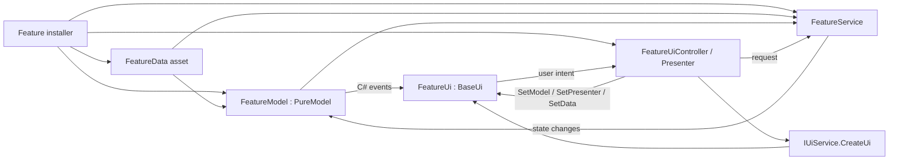

# UI Refactoring Playbook

This document is the instruction for fixing and refactoring a feature UI in this project. It records the approach used for `ReinforcementUi` and turns it into a repeatable flow for the next specific UI.

Always read [[PROJECT_ORGANIZATION|PROJECT_ORGANIZATION.md]] before applying this playbook. Its placement rules remain authoritative.

## Goal

Refactor a feature into explicit Model-View-Presenter responsibilities:

| Part | Responsibility | Must not contain |
| --- | --- | --- |
| `<Feature>Data : Data` | Serialized configuration, prefab mappings, read-only lookup API | Runtime state, event subscriptions, gameplay flow |
| `<Feature>Model : PureModel` | Runtime state, rules, and C# events | `UnityEngine`, `[SerializeField]`, `ScriptableObject`, prefab creation |
| `<Feature>Ui : BaseUi` | Render state and forward user input | Gameplay rules, service orchestration, implicit Zenject feature dependencies |
| `I<Feature>Presenter` | UI intent API | `ICommand` unless it is a real command object |
| `<Feature>UiController` | Create the UI, pass all dependencies through methods, initialize and dispose it | Gameplay implementation |
| `<Feature>Service : Service` | Gameplay/application flow and interaction with non-UI systems | `UiService`, `BaseUi`, UI prefab creation, UI event rendering |

## Apply This Refactor When

Use this flow when one or more of these conditions are true:

- Zenject throws `Unable to resolve ...` while a UI prefab is being created in a different container or subcontainer.
- A UI inherits `BaseUi<TModel>` or `BaseUi<TModel, TCommand>` and depends on feature bindings that are not visible to the UI factory.
- A model is a `ScriptableObject` that mixes serialized configuration with mutable runtime state and events.
- A controller creates or updates UI and also performs gameplay work.
- A service depends on `IUiService`, a concrete UI, `BaseUi`, or UI-only types.
- An interface named `I...Command` only forwards UI intent and does not represent an executable command object.

Do not perform the whole refactor for a missing Inspector reference or a local rendering bug when the existing architecture already satisfies the boundaries above. Fix the narrow bug in that case.

## Target Flow

The important container boundary is at UI creation. The prefab may be created by a parent UI factory, but its feature dependencies are supplied afterward by `<Feature>UiController` through explicit methods.
