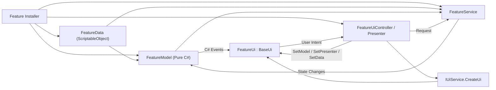

# Empire At War (Unity 6 Project)

An RTS-inspired space-battle game featuring faction control, reinforcement systems, customizable ship behaviors, and economy management. The codebase is heavily structured around strict architectural boundaries (MVP) and integrates advanced developer tools like Model Context Protocol (MCP) and Graphify to support AI-assisted development.

---

## 🚀 Technology Stack

* **Game Engine:** **Unity 6** (Editor Version `6000.4.7f1`)
* **Dependency Injection:** **Zenject** (Extenject) for clean binding lifecycles, project/scene contexts, and factory patterns.
* **Rendering:** **Universal Render Pipeline (URP)** (`17.4.0`) for optimized visual performance.
* **Asset & Data Management:** **Addressables** (`2.9.1`) for dynamic loading of prefabs, visual assets, and databases via the `AddressableRepository`.
* **Input System:** Unity's **New Input System** (`1.19.0`) for scalable cross-platform controls.
* **Animation Engine:** **DOTween** for smooth UI transitions and procedural visual effects.
* **Agent Toolkit & AI Integrations:**
  * **Unity MCP (`com.coplaydev.unity-mcp`):** An in-editor Model Context Protocol server that exposes Unity runtime and editor tools directly to AI coding assistants.
  * **Graphify:** A codebase semantic indexing tool used to map dependency trees and query the project graph.

---

## 🏛️ Architecture (Model-View-Presenter)

The codebase strictly enforces the **Model-View-Presenter (MVP)** pattern to decouple gameplay business rules from Unity-specific APIs and rendering lifecycles.

### Components and Responsibilities:
1. **Model (`PureModel` / Pure C#):** Contains runtime state, business rules, and standard C# events. It has **no** references to `UnityEngine`, serialized fields, or prefabs.
2. **View (`BaseUi` / `MonoBehaviour`):** Captures UI events and forwards user intent to the Presenter. It contains **no** gameplay logic or service dependencies.
3. **Presenter (`UiController`):** Coordinates model updates with the view, handles initialization, and forwards requests to Services.
4. **Service (`Service`):** Handles application/gameplay flows, background actions, and interactions with external/non-UI systems.
5. **Data (`Data` / ScriptableObject):** Contains static configuration, prefab mappings, and read-only APIs.

---

## 📂 Project Organization

The repository follows a strict **type-first** layout under `Assets/`. Developers and AI agents must place new assets according to these root folders:

* **`Assets/Art/`**: Visual source assets (Models, Textures, Materials, Animation).
* **`Assets/Prefabs/`**: Reusable GameObject configurations (UI screens, unit views).
* **`Assets/Scripts/`**: All C# code, separated into `Components/`, `Entities/`, `Services/`, `Editor/`, and `Tests/`.
* **`Assets/Settings/`**: Global configurations, Input Action maps, and HDRP/URP profiles.
* **`Assets/Plugins/`**: Project-wide third-party packages (Zenject, Mirror, DOTween).
* **`Assets/ThirdParty/`**: External assets or documentation.
* **`Assets/Sandbox/`**: Temporary prototypes, debug scenes, and scratchpads.

---

## 📖 Developer Guides

Ensure you read the relevant document before proposing or implementing changes:

* **[PROJECT_ORGANIZATION.md](file:///f:/Private/empire-at-war/PROJECT_ORGANIZATION.md):** Mandatory folder structures and asset placement rules.
* **[UI_REFACTORING_PLAYBOOK.md](file:///f:/Private/empire-at-war/UI_REFACTORING_PLAYBOOK.md):** Detailed checklists and Mermaid flows for migrating UI/features to clean MVP structures.
* **[GRAPHIFY_GUIDE.md](file:///f:/Private/empire-at-war/GRAPHIFY_GUIDE.md):** Guide on installing and using `graphifyy` to build, query, and traverse the codebase dependencies.
* **[AGENTS.md](file:///f:/Private/empire-at-war/AGENTS.md):** Shared instructions, behaviors, and patterns for AI coding assistants working in this repository.
